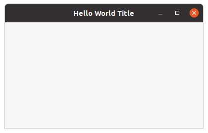

wxWidgets "Hello World" example.



## Dependencies
* wxWidgets

## How to install dependencies
**Ubuntu OS**
* wxWidgets:
```
$ sudo apt-get install libwxgtk3.0-gtk3-dev
```

## Notes
### wxWidgets objects deletion
According to [Window Deletion](https://docs.wxwidgets.org/3.0/overview_windowdeletion.html) spec wxWidgects are suicide objects 
and must have not be deleted by `delete` operator.

Example of the callstack during app closing:
```
virtual MainWindow::~MainWindow()
virtual int App::OnExit()
virtual App::~App()
```

### Compilation defines
Defined on Ubuntu:
```cpp
#define __WXGTK__
#define __WXGTK20__
#define WX_PRECOMP
#define wxUSE_GUI 1
```
